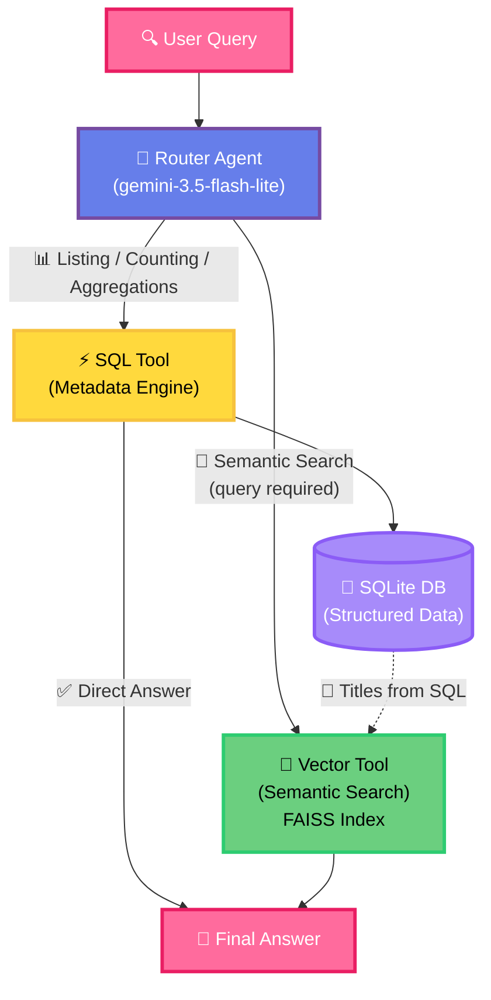

# TableRAG — Hybrid Retrieval-Augmented Generation over Structured + Unstructured Data

TableRAG is a full-stack demo that shows how an LLM agent can intelligently route queries across **two different retrieval backends** — a SQLite relational database and a FAISS vector store — choosing the right engine (or combining both) based on what each query actually needs.

---

## Architecture



### Three Retrieval Paths

| Path | When Used | Example |
|---|---|---|
| 🟡 **SQL** | Counting, listing, aggregating structured metadata | *"How many articles per category?"* |
| 🟢 **Semantic** | Topic or content search (with optional category filter) | *"What do articles say about electric vehicles?"* |
| 🟣 **Hybrid** | Structured filter + content search (date range, word count) | *"Business articles between 500–700 words about stocks"* |

The key design insight: **category filtering does not need SQL**. The FAISS index carries article metadata alongside embeddings, so `filter_category='health'` can be applied directly in the vector store — SQL is only used when the filter genuinely cannot be expressed any other way (e.g. a date range or word count threshold).

---

## Stack

| Layer | Technology |
|---|---|
| LLM / Router | `gemini-3.5-flash-lite` via `google-genai` SDK |
| Vector Store | FAISS + HuggingFace `all-MiniLM-L6-v2` embeddings |
| Database | SQLite via SQLAlchemy |
| Backend | FastAPI + Uvicorn |
| Frontend | React + Vite |

> **Why `google-genai` directly (not LangChain)?** The raw SDK preserves `thought_signatures` in multi-turn tool calls, which is required for the ReAct loop to work correctly with Gemini models.

> 📖 For a deeper dive into the design, see: [Building Cost-Efficient Agentic RAG on Long-Text Documents in SQL Tables](https://towardsdatascience.com/building-cost-efficient-agentic-rag-on-long-text-documents-in-sql-tables/)

---

## Dataset

144 news articles across 8 categories (business, sports, technology, health, travel, fashion, entertainment, politics), sourced from a curated Excel file.

- **SQLite DB** (`dataset/articles.db`): structured columns — `url`, `title`, `authors`, `published_date`, `article_category`, `content_word_count`, `full_content`
- **FAISS Index** (`vector_store/`): embeddings of `full_content` with metadata attached per document

---

## Getting Started

### 1. Prerequisites

- Python 3.9+
- Node.js 18+
- A Google Gemini API key ([get one here](https://makersuite.google.com/app/apikey))

### 2. Install Dependencies

```bash
pip install -r requirements.txt
```

### 3. Configure Environment

```bash
cp .env.example .env
# Edit .env and set your GOOGLE_API_KEY
```

### 4. Set Up the Database and Vector Index

> Skip this step if you are using the pre-built `dataset/articles.db` and `vector_store/` included in the repo.

```bash
python src/setup_resources.py
```

This will:
1. Load `dataset/articles_curated.xlsx` into SQLite
2. Embed all article content using `all-MiniLM-L6-v2` and build the FAISS index

### 5. Start the Backend

```bash
uvicorn src.api:app --reload --port 5000
```

### 6. Start the Frontend

```bash
cd frontend
npm install
npm run dev
```

Open [http://localhost:5173](http://localhost:5173) in your browser.

---

## Project Structure

```
TableRAG/
├── dataset/
│   ├── articles_curated.xlsx   # Source data
│   ├── articles.db             # SQLite database
│   └── schema.json             # DB schema definition
├── frontend/                   # React + Vite UI
│   └── src/
│       └── components/
│           ├── QueryPanel.jsx  # Preset queries + custom input
│           ├── TracePanel.jsx  # Step-by-step routing trace
│           └── ResultPanel.jsx # Final LLM answer
├── src/
│   ├── api.py                  # FastAPI server + ReAct agent loop
│   └── setup_resources.py      # DB + FAISS index setup
├── tests/
│   └── test_queries.py         # Test suite (10 representative queries)
├── vector_store/               # FAISS index (persisted)
├── requirements.txt
└── .env.example
```

---

## Running Tests

```bash
python tests/test_queries.py
```

Runs 10 representative queries covering all three retrieval paths and prints the routed path and response for each.

---

## Environment Variables

| Variable | Required | Description |
|---|---|---|
| `GOOGLE_API_KEY` | ✅ Yes | Gemini API key for the LLM router |

---

## License

MIT
